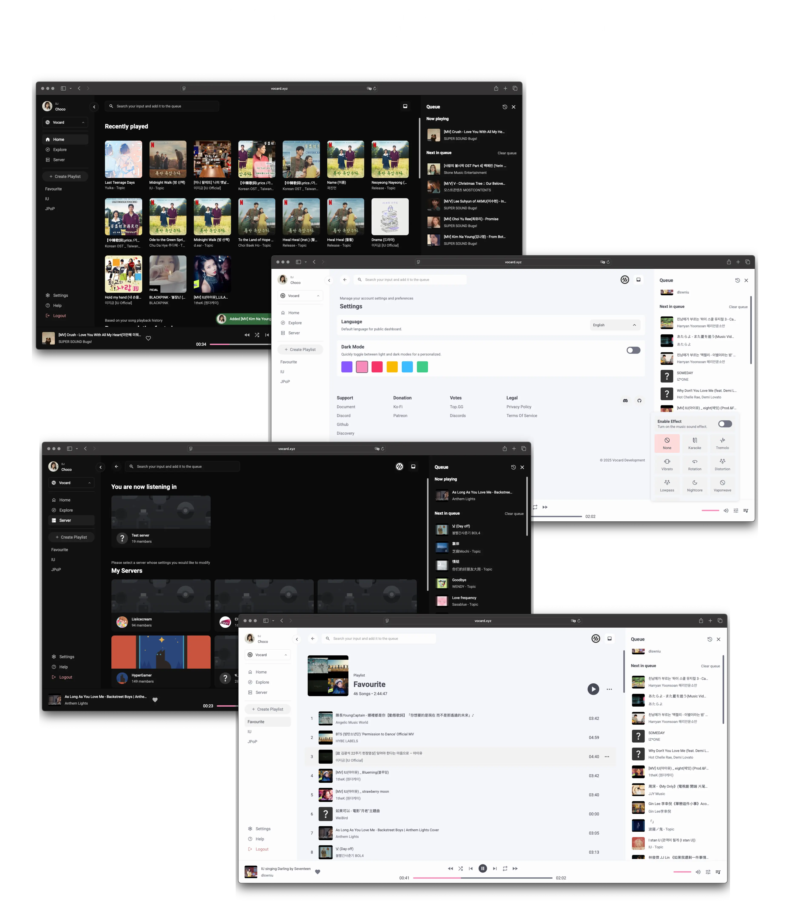

# Vocard Dashboard

Welcome to the Vocard Dashboard! This project provides a user-friendly interface for managing the Vocard Discord bot, enabling users to control music playback, manage playlists, and customize settings easily.

## Features

- **Music Playback Control**: Play, pause, skip, and stop music directly from the dashboard.
- **Playlist Management**: Create, edit, and delete playlists.
- **Search Functionality**: Find songs from various sources quickly.
- **User-Friendly Interface**: Intuitive design for seamless navigation.
- **Real-time Updates**: Instant feedback on actions taken.

## Example Dashboard
[Visit Vocard Dashboard](https://vocard.xyz/login){ .md-button }

## Screenshot
{ width="100%" }

## Setup
Please see the [Setup Page](setup) in the docs to run this bot yourself!

## Need Help?
Join the [Vocard Support Discord](https://discord.gg/wRCgB7vBQv) for help or questions.