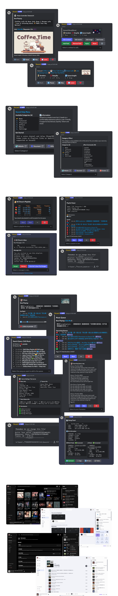

# Home

Vocard is a highly customizable Discord music bot, designed to deliver a user-friendly experience. It offers support for a wide range of streaming platforms including Youtube, Soundcloud, Spotify, Twitch, and more.

## Features
* Fast song loading
* Works with slash and message commands
* Lightweight design
* Smooth playback
* Clean and nice interface
* Supports many music platforms (YouTube, SoundCloud, etc.)
* Built-in playlist support
* Fully customizable settings
* Lyrics support
* Various sound effects
* Multiple languages available
* Easy to update
* Supports docker
* Premium dashboard (in beta)

## Example Bot
[Invite Vocard Bot](https://discord.com/oauth2/authorize?client_id=605618911471468554&permissions=2184538176&scope=bot%20applications.commands){ .md-button }
[Visit Vocard Dashboard](https://vocard.xyz/login){ .md-button }

## Screenshot
{ width="100%" }

## Setup
Please see the [Setup Page](/2.6.9/setup/setup-guide/) in the docs to run this bot yourself!

## Need Help?
Join the [Vocard Support Discord](https://discord.gg/wRCgB7vBQv) for help or questions.